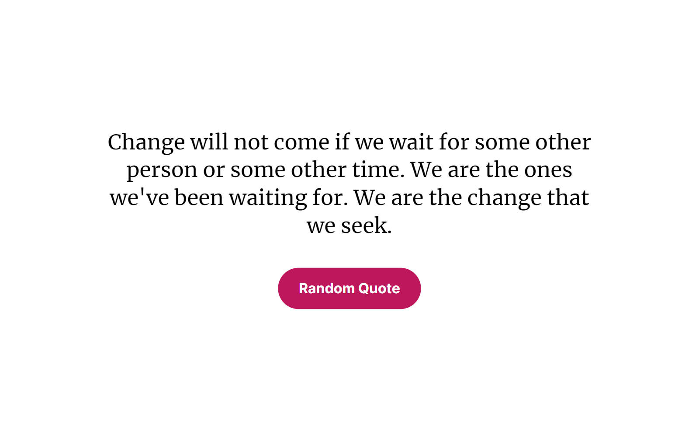

> This repository is used to illustrate a React pattern called "Controller Pattern". In the following, you can find an article describing this pattern.

# The Controller Pattern: Separate business logic from presentation in React

> Summary: The Controller Pattern is an evolution of the Container Pattern. It allows you to clearly separate your logic (like the use of hooks, component-internal state, etc.) from your presentation (i.e. the HTML/JSX). By applying the Controller Pattern, you can make sure that all of your components are structured in the same way, making it easy to maintain your components in the long run.

## Introduction

React gives you a lot of freedom when it comes to structuring your components. Unlike in frameworks like Angular, you aren't forced to separate your business logic (and data) from your HTML. On one hand, this freedom is great because you can work in the way **you** like. Want to quickly sketch a component? Just create a function, throw in some data, return some JSX, and you are done. While this freedom is awesome for quickly getting started building the initial parts of your application, it can become a burden in the long run: Where does the business logic end and the presentational part of my component start? There are now dozens of (helper) functions, but which one was actually meant to be called when clicking this button? I am new to this code base and all components look different - where should I begin?

## The Container Pattern

To clearly separate business logic (like the use of hooks, component-internal state, etc.) from the presentation (i.e. the HTML/JSX), React developers have traditionally used patterns like the [Container Pattern](https://www.freecodecamp.org/news/react-superpowers-container-pattern-20d664bdae65/). When using the Container Pattern, you define two components: The Presentation component, and the Container component. The Presentation component is, as the name implies, only responsible for rendering the UI. This component does not have any internal state, does not call any APIs, etc. The Container component, on the other hand, contains your business logic. This Container component passes all of the necessary data to the Presentation component using Props. Thus, the Container does not deal with the UI, but instead only focuses on state handling, calling APIs, etc.

## Towards the Controller Pattern

By using the Container Pattern, you draw a clear line between the UI and the logic. However, it requires you to create two components. In old versions of React, this was necessary because there was no way to use state and the like outside of a component. However, with the introduction of hooks (and especially the ability to create custom hooks), React laid the foundation for the Controller Pattern. The Controller Pattern is essentially a hook-based version of the Container Pattern and thus, we say that it is an evolution of the Container Pattern.

In the Controller Pattern, you create only one component. This component is only responsible for rendering the UI. The business logic is moved to a custom hook: The controller.

## Component boilerplate code

In its essence, a component built using the Controller Pattern looks like this:

```tsx
interface Props {
  // The Props of the component.
}
export const MyComponent: React.FC<Props> = (props) => {
  const controller = useController(props);

  return (
    // The JSX that shall be rendered.
  );
};

interface State {
  // Component state.
}
interface Controller {
  state: State;

  // Some functions, data, or the like, that shall be accessed in our JSX.
}
function useController(props: Props): Controller {
  const [state, setState] = React.useState<State>({
   // Initial state.
  });

  return {
    state: state,

    // Return what is required by the interface defined above.
  };
}
```

Arguably, it is rather hard to understand what is going on. So let's have a look at an example.

## Example

> Want to experiment with the code shown here? Take a look at [main-page.tsx](./src/main-page/main-page.tsx) and [main-page-without-controller.tsx](./src/main-page/main-page-without-controller.tsx).

To understand how the Controller Pattern works, let's build a small example component. This component is meant to display a random quote coming from an API. The user can click a button "Random Quote" that will make the component fetch and display a new random quote. This is how the application looks like:



Without any specific pattern, you would probably create a component like this:

```tsx
export const FancyQuotes: React.FC = () => {
  const [currentQuote, setCurrentQuote] = React.useState('');
  const [isLoading, setIsLoading] = React.useState(false);

  React.useEffect(() => {
    void loadNewQuote();
  }, []);

  async function loadNewQuote(): Promise<void> {
    setIsLoading(true);

    const quote = await loadRandomQuote();

    setIsLoading(false);
    setCurrentQuote(quote);
  }

  return (
    <div>
      {isLoading && <LoadingIndicator />}

      {!isLoading && (
        <React.Fragment>
          <div>{currentQuote}</div>

          <button type="button" onClick={(): void => void loadNewQuote()}>
            Random Quote
          </button>
        </React.Fragment>
      )}
    </div>
  );
};
```

Let's also add Props to make this a bit more interesting:

```tsx
interface Props {
  onNewQuote: (newQuote: string) => void;
}
export const FancyQuotes: React.FC<Props> = (props) => {
  const [currentQuote, setCurrentQuote] = React.useState('');
  const [isLoading, setIsLoading] = React.useState(false);

  React.useEffect(() => {
    void loadNewQuote();
  }, []);

  React.useEffect(() => {
    if (currentQuote === '') {
      return;
    }

    props.onNewQuote(currentQuote);
  }, [currentQuote]);

  async function loadNewQuote(): Promise<void> {
    setIsLoading(true);

    const quote = await loadRandomQuote();

    setIsLoading(false);
    setCurrentQuote(quote);
  }

  return (
    <div>
      {isLoading && <LoadingIndicator />}

      {!isLoading && (
        <React.Fragment>
          <div>{currentQuote}</div>

          <button type="button" onClick={(): void => void loadNewQuote()}>
            Random Quote
          </button>
        </React.Fragment>
      )}
    </div>
  );
};
```

While this is still somewhat readable, imagine calling 3 more hooks, adding a more complex UI, and maybe throwing in some helper functions. This will quickly become really hard to understand.

Now, the same component using the Controller Pattern:

```tsx
interface Props {
  onNewQuote: (newQuote: string) => void;
}
export const FancyQuotes: React.FC<Props> = (props) => {
  const controller = useController(props);

  return (
    <div>
      {controller.state.isLoading && <LoadingIndicator />}

      {!controller.state.isLoading && (
        <React.Fragment>
          <div>{controller.state.currentQuote}</div>

          <button type="button" onClick={(): void => controller.loadNewQuote()}>
            Random Quote
          </button>
        </React.Fragment>
      )}
    </div>
  );
};

interface State {
  currentQuote: string;
  isLoading: boolean;
}
interface Controller {
  state: State;

  loadNewQuote: () => void;
}
function useController(props: Props): Controller {
  const [state, setState] = React.useState<State>({
    currentQuote: '',
    isLoading: false,
  });

  React.useEffect(() => {
    void loadNewQuote();
  }, []);

  React.useEffect(() => {
    if (state.currentQuote === '') {
      return;
    }

    props.onNewQuote(state.currentQuote);
  }, [state.currentQuote]);

  async function loadNewQuote(): Promise<void> {
    setState((state) => ({ ...state, isLoading: true }));

    const quote = await loadRandomQuote();

    setState((state) => ({ ...state, isLoading: false, currentQuote: quote }));
  }

  return {
    state: state,

    loadNewQuote: (): void => {
      void loadNewQuote();
    },
  };
}
```

What have we done here? First, you will notice that our `FancyQuotes` component does not contain any business logic. Instead, it just uses a hook (`useController()`) and returns some JSX. Thus, when looking at this component, you can easily understand how the UI is composed. You don't need to understand (or even look at) the business logic.

The Controller is a custom hook that contains the entire business logic: It fetches a quote from the API, manages state, etc. Now, the magic relies in the data the hook returns. The return value clearly communicates "This function is meant to be called in the presentational component ('in the JSX'). And this object may also be accessed in our JSX." This is the part where the business logic and the presentation get connected. To clearly define this API, we declare an interface for it:

```ts
interface Controller {
  state: State;

  loadNewQuote: () => void;
}
```

If there was something else we wanted to be used in the presentational component, we would simply add it to the interface of the Controller:

```ts
interface Controller {
  state: State;

  userName: string;

  loadNewQuote: () => void;
}
```

And, of course, we would have to add the actual business logic to our Controller:

```ts
function useController(props: Props): Controller {
  // ...

  const userName = React.useMemo((): string => {
    // ...

    return getUserName();
  }, []);

  return {
    state: state,

    userName: userName,

    loadNewQuote: (): void => {
      void loadNewQuote();
    },
  };
}
```

### State

In theory, we could use state just like in our regular component, and just return it from our Controller:

```ts
function useController(props: Props): Controller {
  const [currentQuote, setCurrentQuote] = React.useState('');
  const [isLoading, setIsLoading] = React.useState(false);

  // ...

  return {
    currentQuote: currentQuote,
    isLoading: isLoading,
    // ...
  };
}
```

However, we want to clearly communicate what our component-internal state looks like. Thus, we define one single state object where the entire state is contained. This also clearly separates state from Props and the rest, so that it is always clear what the "thing" is that you are currently accessing.

To update our state, we just call `setState()` like this:

```ts
setState((state) => ({ ...state, isLoading: false, currentQuote: quote }));
```

### Dealing with "dumb" components

If your component does not contain any business logic, then simply leave out the Controller altogether:

```tsx
interface Props {
  quote: string;
  loadNewQuote: () => void;
}
export const FancyQuotes: React.FC<Props> = (props) => {
  return (
    <div>
      <div>{props.quote}</div>

      <button type="button" onClick={(): void => props.loadNewQuote()}>
        Random Quote
      </button>
    </div>
  );
};
```

## Conclusion

The Controller Pattern defines a strict separation between business logic and presentation. The downside of this pattern is that you need to write more code in the first place. However, you should remember that you will probably read your code much more often than writing it (see https://devblogs.microsoft.com/oldnewthing/20070406-00/?p=27343 and https://www.goodreads.com/quotes/835238-indeed-the-ratio-of-time-spent-reading-versus-writing-is). Thus, investing in a clear component structure will help you stay productive in the long run.

## Bonus tips

### Type-safe state updates

As you might remember, we have updated our component state like this:

```ts
setState((state) => ({ ...state, isLoading: false, currentQuote: quote }));
```

Bonus tip: In TypeScript, this is actually not fully type-safe. If you make a typo in an object key, the compiler will not complain:

```ts
setState((state) => ({ ...state, LOADING: false, currentQuote: quote }));
```

To fix this, you can define a function `merge` like this:

```ts
export function merge<T extends object>(
  baseObject: T,
  patchObject: Partial<T>,
): T {
  return { ...baseObject, ...patchObject };
}
```

Then, update your state using this pattern:

```ts
setState((state) => merge(state, { isLoading: false, currentQuote: quote }));
```

A typo in an object key will now lead to a compiler error.

### Use code snippets

Are you using VSCode? If so, then this tip is for you!

Create a file `.vscode/snippets.code-snippets`. (The file name must end on `.code-snippets`, but the prefix does not matter.)

Then, pase the following:

```
{
  // See https://code.visualstudio.com/docs/editor/userdefinedsnippets

  "reactcomponent": {
    "scope": "typescriptreact",
    "prefix": "reactcomponent",
    "body": [
      "import React from 'react';",
      "",
      "interface Props {",
      "",
      "}",
      "export const $1: React.FC<Props> = props => {",
      "  const controller = useController(props);",
      "",
      "  return <React.Fragment></React.Fragment>",
      "}",
      "",
      "interface State {",
      "",
      "}",
      "interface Controller {",
      "  state: State;",
      "}",
      "function useController(props: Props): Controller {",
      "  const [state, setState] = React.useState<State>({});",
      "",
      "  return {",
      "    state: state,",
      "  }",
      "}"
    ]
  }
}
```

Now, whenever you type "reactcomponent", you get a suggestion that, once accepted, creates the entire boilerplate for a Controller Pattern component.

## Final notes

> Some random final notes by the author (Martin Buchalik).

- One idea that has not been mentioned before: If you want to write tests for your business logic, the Controller Pattern might make your life pretty easy, because you can easily test the "API" that is returned by the Controller.
- I have invented the name "Controller Pattern". There might already be a similar approach under a different name.
- When describing the Container Pattern, I am talking about Presentation and Container components. I found no clear definitions saying how the two components shall be called, thus I decided to simply define the two names like that.
- Please see the Controller Pattern as a source for inspiration: Maybe, developers in your team prefer to destructure Props. Or to create two hooks instead of one. Or... Simply adapt the pattern to your personal preferences. The only thing I suggest: Clearly define (e.g. in a README file) how an ideal component should look like. And try to enforce standards e.g. using a linter. Otherwise, you will end up with multiple "flavors" in your code base, reducing the benefits of the Controller Pattern.
